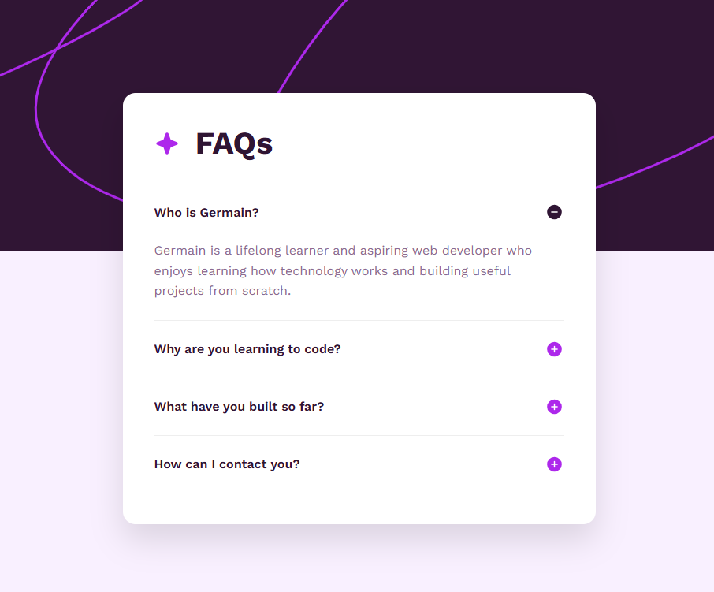

# FAQ Card

## What it does

An interactive FAQ card about Germain. Visitors can open and close questions, and only one answer stays open at a time.

## Built with

* HTML
* CSS
* JavaScript
* Git and GitHub

## What I learned

I practiced using `
` and `
` elements, responsive CSS, keyboard focus states, and JavaScript functions that control the `open` property. I also practiced using separate Git branches and pull requests for each layer of the project.

## Live site

https://germlkg11-ctrl.github.io/faq-card/

## Repository

https://github.com/germlkg11-ctrl/faq-card

## Screenshot

